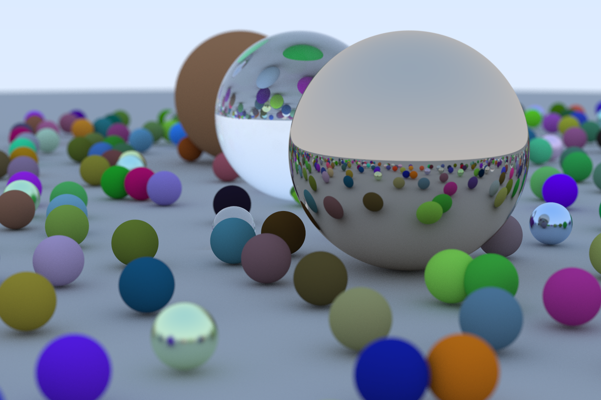

# raytracer

Followed guide from https://raytracing.github.io/ as a way to practice Rust

Completed "Ray Tracing in One Weekend" (and added parallelization using Rayon):

TODO - Ray Tracing: The Next Week
