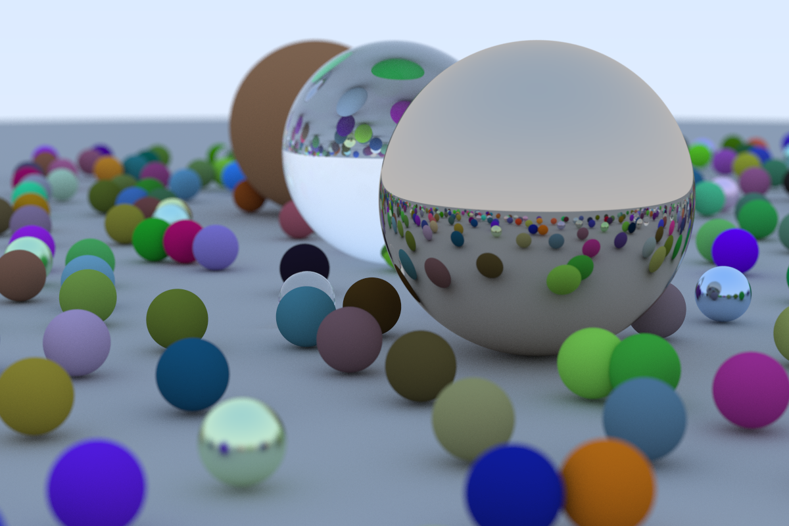
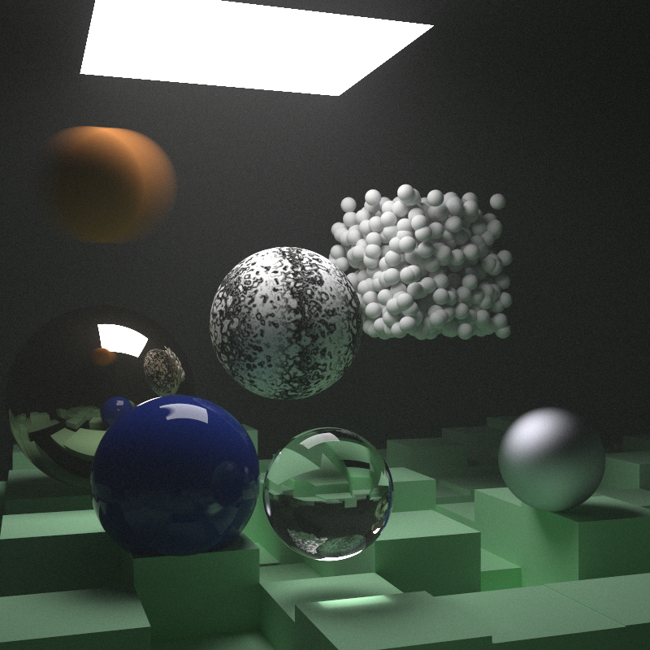
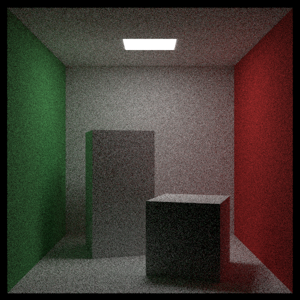

# raytracer

Followed guide from https://raytracing.github.io/ as a way to practice Rust

Completed "Ray Tracing in One Weekend" (and added parallelization using Rayon):

Completed (except for image texture mapping) "Ray Tracing: The Next Week":

TODO:
1. Finish Image Texture Mapping from Book 2
1. Go through Book 3
1. Code cleanup
